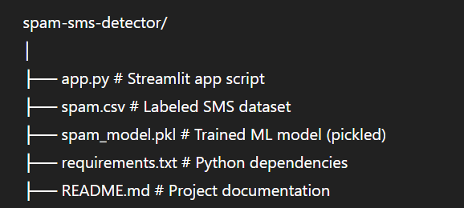

# 📵 Spam SMS Detection Web App

A simple and effective machine learning web application that detects whether an SMS message is **Spam** or **Not Spam** using a **Support Vector Machine (SVM)** classifier. The app features a clean and responsive GUI powered by **Streamlit**.

---

## 🔍 Project Overview

Unwanted spam messages are annoying and potentially dangerous. This project aims to build a machine learning model that can accurately classify SMS messages to help users filter out spam.

The app was developed using Python and several popular data science libraries, with a Streamlit-based web interface for easy interaction.

---

## 💡 Features

- Real-time spam message detection
- Clean and interactive GUI built using Streamlit
- Data visualization for exploratory analysis
- TF-IDF vectorization for converting text into numerical form
- SVM (`LinearSVC`) classifier for high-performance prediction

---

## 🛠 Tech Stack

**Frontend / GUI**:  
- Streamlit

**Backend / ML**:  
- pandas  
- scikit-learn  
- seaborn  
- matplotlib  
- NumPy  
- Support Vector Machine (`LinearSVC`)

---

## 📁 Project Structure




---

## 📊 Dataset Info

- **Source**: SMS Spam Collection Dataset (Kaggle)
- **Features**:
  - `label`: spam or ham (not spam)
  - `message`: actual SMS content

---

## ⚙️ How to Run the Project Locally

### 1. Clone the Repository

```bash
git clone https://github.com/AyazAhmad03/CODSOFT.git
cd spam-sms-detector


2.Run the Streamlit App
streamlit run app.py
